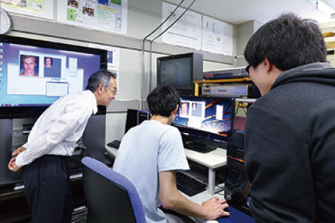

# 情報工学科の紹介
<!-- Markdown記法を使って学科の紹介ページを作る -->
# 専門的な学びを深める
２年次から学びたい分野に合わせてコースを選択し、より深く学ぶことができます:laughing::+1:

* コース
*基本的な３つのコース*
   1. システムエンジニアリングコース
   2. インターネット＆セキュリティコース
   3. 知能情報コース
* コラボレーションコース
*デザイン学科とのコラボレーションコース*
   1. ビジュアルコンピューティングコース
   2. webデザインコース
# 学科データ
* 生徒数

男子生徒 | 女子生徒
------- | -------
319人 | 22人
* 関連する資格・試験
  * 教員免許（高等学校教諭）
  * 商業施設士
  * 商業施設士補［（公社）商業施設技術団体連合会］

[情報工学科サイト](https://feng.takushoku-u.ac.jp/course/cs/)
<!-- この部分より上に記述を追加して下のチェックボックスで確認する -->
- [ ] 2種類以上の見出し(headers)を使っている．
- [ ] 2種類以上の強調(emphasis)を使っている．
- [ ] (番号付きの)リスト(ordered lists)を使っている
- [ ] (番号無しの)リスト(unordered lists)を使っている．
- [ ] 1つ以上の画像(images)を使っている．
- [ ] 1つ以上のリンク(links)を使っている．
- [ ] 1つ以上の表(tables)を使っている．
- [ ] 1つ以上の絵文字を使っている．
